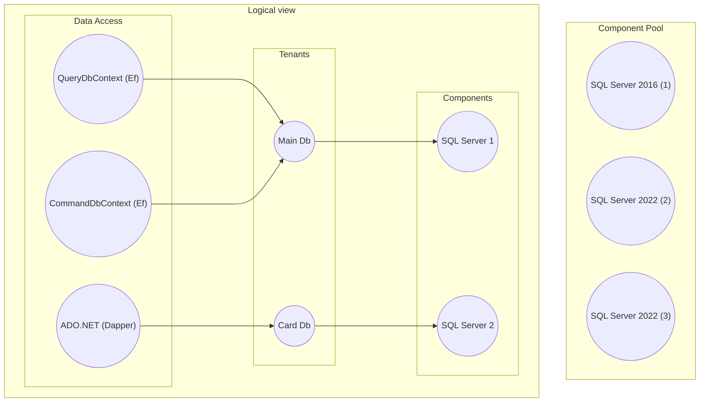

# DataIsland

[](https://github.com/jahav/dataisland/actions/workflows/build.yml)
[](https://codecov.io/github/jahav/dataisland)
[](https://dataisland.readthedocs.io/en/latest/)

DataIsland is a project to enable parallel execution of integration tests. It takes advantage of the idea, that starting up components (e.g. SQL Server)
is slow and takes up a lot of resources, but creating very small tenant on component (e.g. new SQL database on existing SQL Server) is fast and takes very
few resources.

Integration tests generally either run sequentially (if they use real components) or use fakes (e.g. in memory SQLite). Both options are suboptimal.
Sequential processing is slow and fakes mean integration tests are not using same environment as on PROD and thus don't know if it actually works.


## Quick Start

The QuickStart assumes that there is only one database and it is accessed through an EfCore using a single DbContext. Testing framework is xUnit v3.

```sh
dotnet new install xunit.v3.templates
dotnet new xunit3
dotnet add package DataIsland.SqlServer -v 1.0.2
dotnet add package DataIsland.EfCore -v 1.0.2
dotnet add package DataIsland.xUnit.v3 -v 1.0.2
```

### 1. Define template

Template is a definition of how should whole data access look like for each test that uses the template. In this case, materializer should create
one database, fill it with data from a backup and the database should be accessed through MyDbContext.

```csharp
// Only one instance per assembly
[assembly: AssemblyFixture(typeof(DataIslandFixture))]
namespace Demo;

public class DataIslandFixture
{
    public DataIslandFixture()
    {
        // Pool where materializer creates database for each test. Just use locally installed one.
        var sqlServerPool = SqlServerComponentFactory.ExistingSqlServer("Data Source=.;Integrated Security=True;TrustServerCertificate=True");

        // Factory used by materializer to create database for each test. Need a place to store mdf/ldf for test databases.
        var databaseFactory = new SqlDatabaseTenantFactory(@"c:\Temp\dataisland\files");
        Lake = new TenantLakeBuilder()
            .AddComponentPool("SQL Server", sqlServerPool, databaseFactory)
            .AddPatcher(new EfCorePatcher<MyDbContext>())
            .AddTemplate("Template name", opt =>
            {
                // Database is accessed through EFCore with a DbContext MyDbContext
                opt.AddDataAccess<MyDbContext>("SQL Database");

                // Optional, but useful. Each created db will be filled with data from the backup.
                var initialStateBackup = new SqlDatabaseDataSource().FromDisk(@"c:\Temp\integration-tests-backup.bak");

                // Materializer will create database for each test on "SQL Server" pool.
                opt.AddTenant<SqlDatabaseTenant, SqlDatabaseSpec>(
                    "SQL Database",
                    "SQL Server",
                    spec => spec.WithDataSource(initialStateBackup));

                // This template is using "Sql Server" pool.
                opt.AddComponent<SqlServerComponent, SqlServerSpec>("SQL Server");
            })      
            .Build(new XUnitTestContext());
    }

    public ITenantLake Lake { get; }
}
```

### 2. Patch DI

The application must use the database set-up for each test and that is done through patchers. They modify registration of EfCore DbContext, so when
Microsoft Dependency Injection (MSDI) resolves MyDbContext, it will use connection string to database created for the test instead of original
connections string.

```csharp
public class ClassFixture
{
    public ClassFixture(DataIslandFixture dataIslandFixture)
    {
        // Register application services
        var services = new ServiceCollection();      
        services.AddDbContext<MyDbContext>(opt => opt.UseSqlServer("doesn't matter, will be replaced"));

        // Patch DI. This method must be last! It is overriding previous service registrations.
        services.AddDataIsland<ClassFixture>(dataIslandFixture.Lake);
        ServiceProvider = services.BuildServiceProvider();
    }

    public ServiceProvider ServiceProvider { get; }
}
```

### 3. Assign template

Use `[ScopedTenants]` attribute to declare theat DataIsland should set-up database for each test in the class. Because
of class fixture, tests in MyTests class are executed sequentially, but MyTests is run in parallel with other tests.

```csharp
// the ScopedTenants attribute declares that Materializer should create database
// per template before each test is run and clean it up afterward.
[ScopedTenants("Template name")]
public class MyTests : IClassFixture<ClassFixture>
{
    private readonly ClassFixture _fixture;

    public MyTests(ClassFixture fixture)
    {
        _fixture = fixture;
    }

    [Fact]
    public async Task DemoTest()
    {
        // By here, materializer already created database for this test and MSDI is patched
        // to resolve MyDbContext that is connected to newly created database.
        using var scope = _fixture.ServiceProvider.CreateScope();
        var test = scope.ServiceProvider.GetRequiredService<MyDbContext>();
        var userCount = test.Users.Count();
        Assert.Equal(3, userCount);

        // Delay, so you can see database in SSMS
        await Task.Delay(10000);
    }
}
```

## How does it work?

1. Create a pool of components
1. Define logical views
2. Initialize component pool
3. For each collection (in parallel)
    1. In fixture, patch DI container to resolve database created per test instead of original database
    2. For each test in collection
        1. Get physical components from component pool that match components specs in logical view
        2. Create tenants per logical tenant spec on associated components
        3. Associate created tenants with logical names
        4. Run test. The data access resolved in the tast will resolve test database created for the test.
        5. Delete test tenants
4. Dispose of component pool

### Define logical views

Logical view defines a how data structure that should be used for a test. Each test specifies the
requested logical view (by name).

The view consists of three parts:
* component
* tenant
* data access

The logical view describes what is desired with no relation to actual resources present. The library
materializes desired logical view before each test and ensures it matches the logical view structure
and requirements.



### Component

Component is an external component that manages data. Preferably, it should support multi-tenancy.

Examples: SQL Server, PostgreSQL, SQLite, Azure blob storage, Amazon S3, RabbitMQ, 

Each component in a logical view has a logical name and a set of requirements. Logical name of a
component is unique in a logical view. The set of requirements is a set of properties specific for
a component type that are required. E.g. for SQL Server, the requirement could be collation (e.g.
`Czech_CI`) or database version (`SQL 2022`).

During tenant creation, the component acquired from the component pool is guaranteed to satisfy
the declared specification. Library doesn't create component for each test again and again, but
instead resuses them from the pool. Components are therefore shared (=global state) across multiple
parallel running tests and developer must exercise care not to modify them.

### Tenant

Tenant is a structure in a component that is used.to store data. In most multi-tenant components,
tenant is just a tenant (e.g. database in SQL Server or virtual host in RabbitMQ).

Examples: Database for SQL database, virtual host for RabbitMQ

Tenants from logical view are materialized for each test and are not shared. Each test gets its
own tenants. Once test has finished, materialized tenants of the test are removed.

Tenant  has a logical name and a set of required specifications used for its creation (e.g. SQL
Database is created with data from a backup).

Situation is slighly more difficult components that don't support multi-tenancy. In such cases,
tenancy is generally ensured by custom wrapper of data access and a usage of a prefix.
Example: For Azure Blob Storage, all containers are prefixed by a unique prefix. Test1 with
unique prefix `48fd` will actually use containers `48fd-images` and `48fd-archive` while Test2 with
a unique prefix `ad57` will use containers `ad57-images` and `ad57-archive`. The custom data access
wrapper will take care of translation of container names and this method will ensure each test
has its own data, isolated from other tests.

#### Data Access

Data access is a service (from MSDI point of view) used in .NET application that interacts with a tenant. E.g. 

* EfCore, Dapper, ADO.NET, NHbernate are services used to interact with SQL databases.
* MassTransit, NServiceBus, Rebus are services that interact with message broker (e.g. RabbitMQ, Kafka)

Note that multiple services can access same tenant (e.g. two different DbContexts can access same database).

## Initialize component pool

After a component pool is created, it dopesn't necessarily has anything in it. It might be necessary to initialize
it, e.g. to spin up docker containers. The initialization is done once.

## What is the problem?

Integration tests need external components (e.g. database). External components are hard and slow to instantiate and prepare.
The integration tests therefore have to balance two competing requirements:

* Test speed
* Test isolation

There are three strategies:
* Use fakes in place of real dependencies. E.g. [Integration tests in ASP.NET Core](https://learn.microsoft.com/en-us/aspnet/core/test/integration-tests)
  recommend to use SQLite instead of real database backend. That is fine for simple cases, but different feature-set of databases causes problems (stored
  procedures, transactions, available functions).
* Use real external dependency and execute tests sequentially. This approach works, but is really slow and will get slower with growing number of tests.
  This also necessites a need to ensure clean the state of dependency after each test. There are libraries that help with that, e.g. [Respawn](https://github.com/jbogard/Respawn).
* Instantiate a separate dependency for each test. This is seriously problematic because of resources and slow startup time and is least practical one.
  E.g. SQL Server docker requires 1.1 GB and takes tens of seconds to start.

DataIsland tries to solve this problem by taking advantage of multi-tenancy available to most data stores. It's expensive to spin-up a new SQL Server, but
very fast to create empty database.

The test project has to define what kind of data sources it requires and dataset it shoudl use to initialize them and after that, just run your tests. DataIsland
hooks up into DI to create a new tenants in data sources and adjusts the connections for data access frameworks (e.g. `EFCore`).

|  Component    | Tenant       | Data access              |
|---------------|--------------|--------------------------|
|  SQL Server   | Database     | EfCore, Dapper, ADO.NET  |
|  RabbitMQ     | Virtual Host | MassTransit, NServiceBus |
|  Blob Storage | Container    | TwentyTwenty.Storage     |

# Design decision

## Eager tenant creation

Tenants are created eagerly just before the test is run, e.g. in `BeforeAfterTestAttribute`. That is because
tenant creation 

* requires significant amount of time.
* requires async API. A lot of libraries don't event offer sync API.

Dependency injection framework are for creation of objects. They should be created very fast and no DI
framework even offers async API. That is by design. 

It would be therefore necessary to do some kind of sync-async wrapper and that way goes madness and
deadlocks. Created tenants are also runtime data and they shouldn't be stored in DI.

Links:

* [Async DI factories can cause deadlocks](https://learn.microsoft.com/en-us/dotnet/core/extensions/dependency-injection-guidelines#async-di-factories-can-cause-deadlocks)
* [Dependency Injection Code Smell: Injecting runtime data into components](https://blogs.cuttingedge.it/steven/posts/2015/code-smell-injecting-runtime-data-into-components/)
